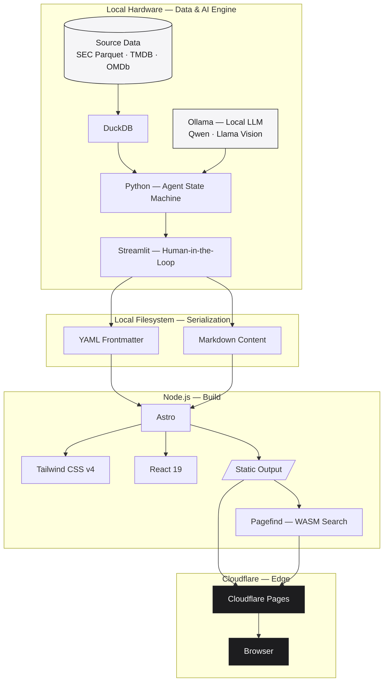
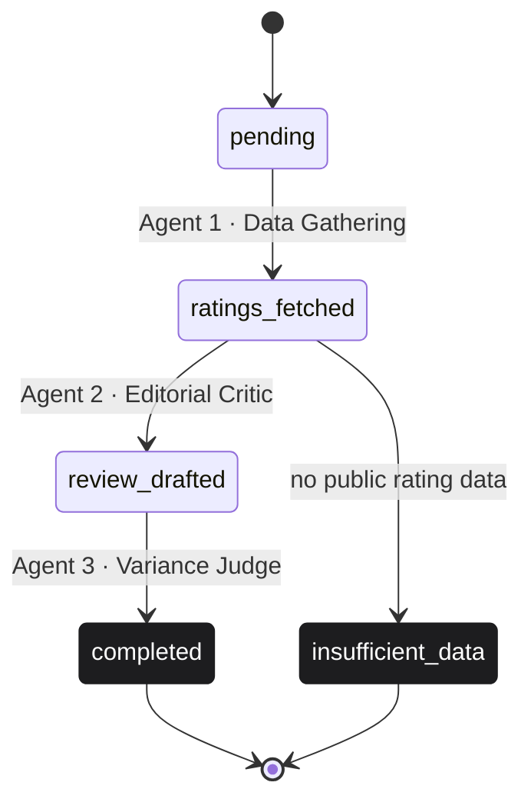

# Variance Loop

**Continuous Discovery.**

*A four-product AI publishing ecosystem — architected, built, and deployed solo.*

[varianceloop.com](https://varianceloop.com)

 

 

Variance Loop generates and continuously refreshes editorial content across four verticals — institutional markets, macro & geopolitics, film, and automotive design — using agentic AI workflows running against locally hosted models.

It's a self-directed project, not a commercial product: built to explore current agentic AI and systems design patterns in a real, live deployment rather than a demo.

This repository holds architecture notes only. Application source lives in private repositories.

 

---

 

## The Ecosystem

 

<table>
<tr>
<td width="50%" valign="top">

### Terminal
`terminal.varianceloop.com`

Institutional-markets analysis comparing retail sentiment against institutional capital flow, built on aggregated SEC filings and positioning data.

</td>
<td width="50%" valign="top">

### News
`news.varianceloop.com`

Macro and geopolitical synthesis over SEC Parquet datasets, surfacing structural narrative shifts.

</td>
</tr>
<tr>
<td width="50%" valign="top">

### Cinema
`cinema.varianceloop.com`

Audits rating variance — comparing LLM-generated reviews against public rating aggregates to flag rating inflation and review-bombing.

</td>
<td width="50%" valign="top">

### Cars
`cars.varianceloop.com`

Automotive design analysis using vector embeddings to score proportions, aesthetic continuity, and design language.

</td>
</tr>
</table>

 

---

 

## Architecture

 

A single principle governs the whole system: **keep heavy compute and large datasets on local hardware, ship only compiled static output to the edge.**

Local inference avoids ongoing cloud GPU cost and keeps proprietary prompts and multi-gigabyte datasets off the network. Everything that reaches the public internet is pre-compiled static output — no live database exposure, no backend attack surface.

 

---

 

## Cinema — Agentic Pipeline

 

The clearest example of the pattern used across the ecosystem: a resumable, checkpointed state machine implementing an **LLM-as-a-judge** design, deliberately isolating review generation from review auditing.

 

<strong>Design details</strong>

 

- **Checkpointed after every agent.** An interrupted run resumes from the last completed state instead of redoing work.
- **Immutable audit trail.** Every fetch and prompt execution appends to a per-title log — a transparent record of what the system did.
- **Guardrail against hallucination.** If Agent 1 can't find enough public rating data, the pipeline halts at `insufficient_data` rather than letting the model invent a report.
- **Blinded review generation.** Agent 2 drafts from neutral plot and cast facts only, with no visibility into public sentiment — keeping Agent 3's judgment non-circular.

 

---

 

## Stack

 

| | |
|---|---|
| **Backend / AI** | Python 3.11 · FastAPI · Ollama (local inference) · DuckDB · Pydantic · Streamlit |
| **Frontend** | Astro · Tailwind CSS v4 · React 19 · Framer Motion · Pagefind |
| **Data** | Postgres / pgvector · SEC EDGAR filings · Parquet |
| **Infra** | Cloudflare Pages · Wrangler CLI · Oracle Cloud (Ampere A1) · Docker Compose |

 

---

 

Application source is private. Happy to walk through it directly as part of a hiring conversation.

[varianceloop.com](https://varianceloop.com) · [github.com/Savanand](https://github.com/Savanand)

