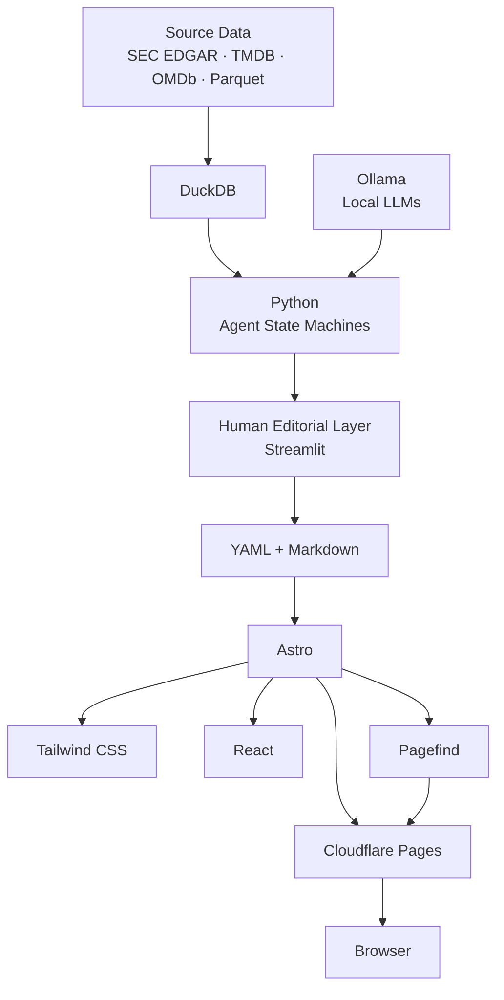
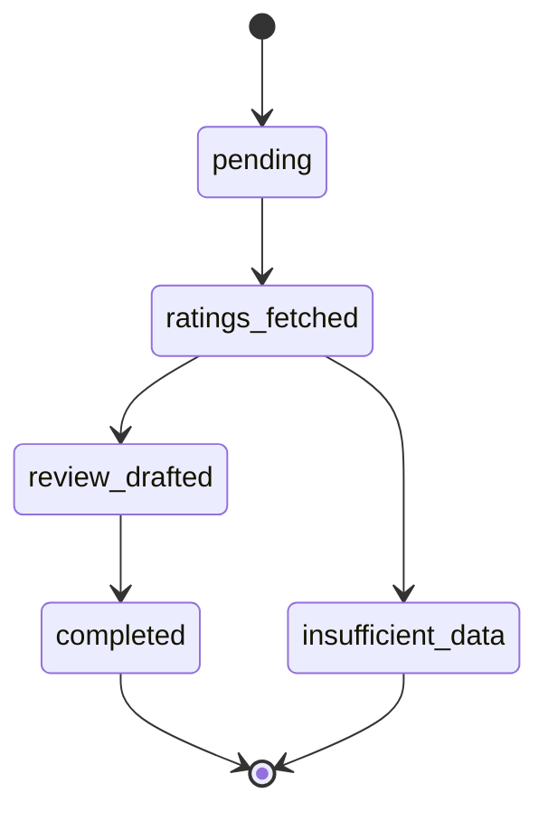

<div align="center">

# Variance Loop

### Continuous Discovery.

**A locally-run AI publishing system for turning large datasets into continuously refreshed, human-reviewed intelligence.**

[Live System](https://varianceloop.com) · [Terminal](https://terminal.varianceloop.com) · [News](https://news.varianceloop.com)

</div>

<br>

<div align="center">

`LOCAL AI`  ·  `AGENTIC WORKFLOWS`  ·  `HUMAN-IN-THE-LOOP`  ·  `STATIC EDGE`

</div>

---

## What is Variance Loop?

Variance Loop is a four-product AI publishing ecosystem built to explore what happens when **large datasets, locally hosted models, agentic workflows, and editorial systems** are treated as one continuous system rather than isolated AI demos.

The system currently spans:

| Product      | Focus                                                        |
| ------------ | ------------------------------------------------------------ |
| **Terminal** | Institutional markets, sentiment and capital-flow analysis   |
| **News**     | Macro and geopolitical narrative synthesis over SEC datasets |
| **Cinema**   | Rating variance, review quality and review-bombing analysis  |
| **Cars**     | Automotive design analysis using visual embeddings           |

The goal is simple:

> **Find signals that are difficult to see when data, models, and publishing are disconnected.**

---

# Architecture

The central architectural decision is:

> **Keep heavy computation and large datasets local. Ship only compiled output to the edge.**



This separation keeps the expensive parts of the system close to the data while the public layer remains fast, cacheable, and largely static.

No public application database is required to render the published experience.

---

# The Engineering Model

Variance Loop is built around a few deliberate constraints.

### Local-first intelligence

Large datasets and model inference remain on local hardware rather than being pushed into a hosted GPU pipeline.

The AI layer uses locally hosted models through **Ollama**, with Python orchestrating data access, agent state, structured generation, and validation.

### Human-in-the-loop publishing

Models generate candidate material.

Humans review it.

Only approved material reaches the publishing layer.

The system therefore treats **generation and publication as separate concerns**.

### Resumable agents

Long-running AI workflows are implemented as explicit state machines.

A process can stop after an intermediate stage and resume rather than restarting the entire job.

### Evidence before synthesis

Where source data is insufficient, the system is designed to stop rather than manufacture a conclusion.

That principle is particularly visible in the Cinema pipeline.

---

# Agentic Pipeline

Cinema is one of the clearest examples of the architecture.



Three agents operate as distinct stages:

**01 — Data Gathering**

Collect publicly available rating and title information.

**02 — Editorial Critic**

Generate a review from neutral plot and cast information without exposing public sentiment.

**03 — Variance Judge**

Compare the generated assessment against aggregated public ratings.

The important part is not the LLM itself.

The important part is the **system around the LLM**:

* checkpointed execution
* explicit state transitions
* immutable execution logs
* insufficient-data termination
* separation between generation and evaluation

---

# Publishing Architecture

The publishing path is intentionally boring.

```text
AI / Data Processing
        ↓
Human Review
        ↓
Structured Markdown
        ↓
Astro Build
        ↓
Static Output
        ↓
Cloudflare Edge
```

This avoids turning every article request into a backend request.

Published content can therefore be served as compiled web output while the expensive intelligence layer remains elsewhere.

---

# Four Products

## Terminal

**Institutional markets**

Analysis of retail sentiment versus institutional capital flows using aggregated SEC filing and positioning data.

[terminal.varianceloop.com](https://terminal.varianceloop.com)

---

## News

**Macro + Geopolitics**

Narrative synthesis built over SEC Parquet datasets, designed to surface structural shifts hidden inside large volumes of filings and market information.

[news.varianceloop.com](https://news.varianceloop.com)

---

## Cinema

**Rating variance**

An agentic pipeline comparing generated critical assessments against public rating aggregates to investigate rating inflation and review-bombing patterns.

[cinema.varianceloop.com](https://cinema.varianceloop.com)

---

## Cars

**Automotive design**

Visual analysis using vector embeddings to evaluate proportions, aesthetic continuity, and design language.

[cars.varianceloop.com](https://cars.varianceloop.com)

---

# Stack

### AI / Backend

`Python 3.11` · `FastAPI` · `Ollama` · `DuckDB` · `Pydantic` · `Streamlit`

### Frontend

`Astro` · `Tailwind CSS` · `React` · `Framer Motion` · `Pagefind`

### Data

`Postgres` · `pgvector` · `SEC EDGAR` · `Parquet`

### Infrastructure

`Cloudflare Pages` · `Wrangler` · `Docker` · `Oracle Cloud`

---

# Why Local AI?

The interesting constraint is not simply running an LLM locally.

It is designing the entire system around that constraint.

Large source datasets stay close to computation.

Prompts and proprietary orchestration remain local.

The public network receives compiled output instead of becoming part of the core intelligence pipeline.

That changes the architecture from:

```text
User → API → Database → GPU → LLM → Response
```

to:

```text
Data → Local Intelligence → Human Review → Build → Edge
```

For publishing-oriented systems, that distinction is significant.

---

# What This Repository Is

This public repository is the **architectural and systems showcase** for Variance Loop.

Production application source, private prompts, internal datasets, credentials, deployment configuration, and operational tooling remain in private repositories.

The public project exists to make the engineering decisions inspectable without exposing the private implementation.

---

# Design Philosophy

### Compute locally.

Move data, not unnecessary infrastructure.

### Make AI workflows explicit.

Prefer state machines over opaque chains of model calls.

### Keep humans in the loop.

Generation is not publication.

### Fail closed on missing evidence.

Insufficient data should terminate a workflow rather than produce synthetic certainty.

### Compile where possible.

The public web should not carry infrastructure that does not need to be there.

### Keep the system understandable.

Every architectural component should justify its existence.

---

<div align="center">

## Variance Loop

**Continuous Discovery.**

[varianceloop.com](https://varianceloop.com)

Built as an independent exploration of AI systems, data infrastructure, editorial workflows, and edge publishing.

</div>
